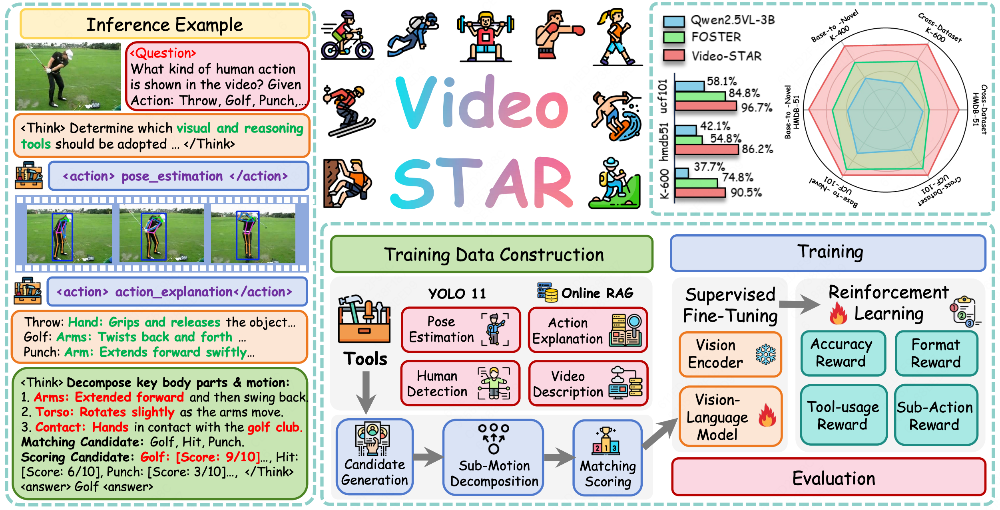
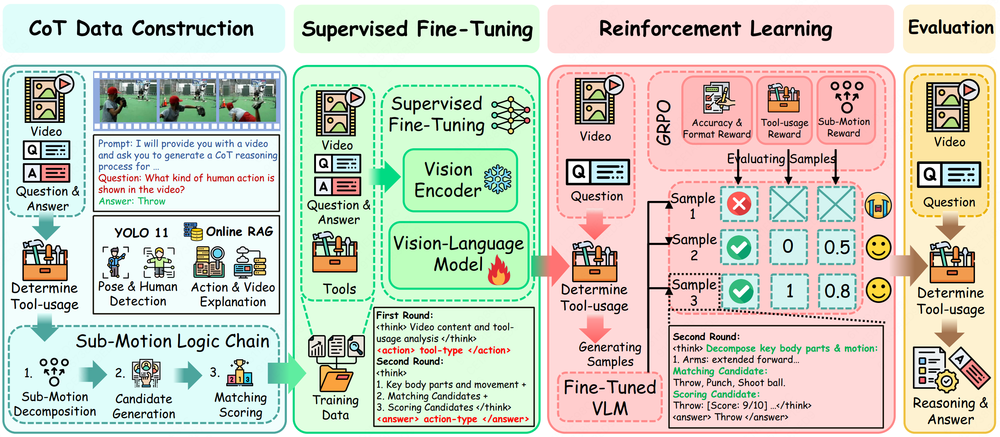

# Video-STAR: Reinforcing Open-Vocabulary Action Recognition with Tools

<h3 align="center">
  ICLR 2026
</h3>

[](https://arxiv.org/pdf/2510.08480)
[](LICENSE)

[[📖 Paper](https://arxiv.org/pdf/2510.08480)] [[🤗 Video-STAR-3B](https://huggingface.co/GD-ML/Video-STAR-3B)] [[🤗 Video-STAR-3B-COT-SFT](https://huggingface.co/GD-ML/Video-STAR-3B-COT-SFT)] [[🤗 Video-STAR-7B](https://huggingface.co/GD-ML/Video-STAR-7B)] [[🤗 Video-STAR-7B-COT-SFT](https://huggingface.co/GD-ML/Video-STAR-7B-COT-SFT)]

<p align="center">
    
</p>

## 👀 About Video-STAR

Video-STAR is a novel framework that harmonizes **contextual sub-motion decomposition** with **tool-augmented reinforcement learning** for open-vocabulary action recognition (OVAR).

Unlike prior methods that treat actions as monolithic entities, Video-STAR innovatively decomposes actions into discriminative sub-motions for fine-grained matching while dynamically invoking domain-specific tools for cross-modal interleaving, thereby enabling category-specific reasoning capacity and reducing cross-modal hallucination.

---

## 🎯 Core Task

**Input:**
- Video clips (action sequences)
- Text query for open-vocabulary recognition

**Output:**
- Action class prediction
- Reasoning chain with tool invocation

**Reasoning Process:**
1. **Sub-Motion Decomposition**: Break down holistic actions into discriminative sub-motion primitives (e.g., "shoot basketball" → "leg bending" → "torso jumping" → "arm extending" → "hand-ball releasing")
2. **Candidate Selection**: Map each sub-motion to pre-defined action definitions, generating 2-3 semantically relevant candidates
3. **Matching Scoring**: Compare all sub-motions against each candidate's detailed definition and select the highest-scoring action

---

## 🏗️ Architecture

<p align="center">
    
</p>

<p align="left">
    <b>Pipeline of our method.</b> We adopt a two-stage training process. The first stage introduces an innovative tool-augmented CoT dataset for SFT, which decomposes actions into contextual sub-motions with multi-tool integration (pose estimation, human detection, online retrieval). The second stage proposes a hierarchical reward framework for GRPO optimization, which incorporates accuracy, format, tool-usage efficiency, and sub-motion relevance for reliable action recognition.
</p>

---

## 📍 Features

- **Qwen2.5-VL Base Model**: Leverages state-of-the-art vision-language capabilities
- **Sub-Motion Decomposition**: Fine-grained action understanding through hierarchical motion primitives
- **Multi-Tool Integration**: Dynamically invokes pose estimation, human detection, and online retrieval
- **Agentic RL Training**: GRPO with hierarchical rewards balancing accuracy, format, tool-usage, and sub-motion relevance
- **Cold-Start SFT**: Supervised fine-tuning before RL to stabilize tool invocation
- **Multi-Dataset Support**: Trained and evaluated on HMDB-51, UCF-101, Kinetics-400, Kinetics-600, and SSv2

---

## 📂 Project Structure

```
recognition/
├── AFile/                       # Data storage
│   ├── datasets/                # Raw video data from mmaction2
│   ├── json/                    # Table 1: Base-to-Novel eval files
│   └── json_split/              # Table 2: Cross-dataset eval files
├── AScripts/
│   ├── YOLO/                    # YOLO pose estimation scripts
│   │   ├── hmdb51/
│   │   ├── ucf/
│   │   ├── kinetics400/
│   │   ├── kinetics600/
│   │   └── ssv2/
│   ├── acot.py                  # CoT data generation
│   ├── api_image.py             # Key frame extraction
│   ├── ceval1oss/               # Table 1 evaluation scripts
│   ├── ceval2oss/               # Table 2 evaluation scripts
│   ├── ceval3oss/              # Additional evaluation scripts
│   └── cresult/                # Result evaluation scripts
├── src/
│   ├── r1-v/                    # Main training framework
│   │   ├── src/open_r1/
│   │   │   ├── trainer/         # GRPO trainers
│   │   │   ├── oss_sft_*.py     # SFT scripts
│   │   │   └── oss_grpo_*.py    # GRPO scripts
│   │   └── local_scripts/       # Data preparation
│   └── qwen-vl-utils/          # Qwen-VL utilities
├── requirements.txt
└── README.md
```

[!NOTE]
The Reasoning Data and its Corresponding Training Code specifically for the Something-Something V2 dataset will be available soon.

---

## 🔍 Dataset

### Training Data

| Dataset | Samples | Description |
|---------|---------|-------------|
| `sft.json` | ~5K | SFT training data (with sub-motion reasoning) |
| `cot.json` | ~5K | CoT training data (with tool augmentation) |
| `rl.json` | ~5K | RL training data |

### Evaluation Data

| Dataset | Samples | Description |
|---------|---------|-------------|
| `hmdb51_test.json` | ~1.8K | HMDB-51 benchmark (51 classes) |
| `ucf_test.json` | ~3.7K | UCF-101 benchmark (101 classes) |
| `k400_test.json` | ~9.2K | Kinetics-400 benchmark (400 classes) |
| `k600_test.json` | ~10K | Kinetics-600 benchmark (600 classes) |
| `ssv2_test.json` | ~2.2K | Something-Something V2 benchmark (174 classes) |

### Download Datasets

#### Original Video Datasets

Follow the instructions from [mmaction2](https://github.com/open-mmlab/mmaction2) to download the original video datasets. Place all downloaded data in the following directory:

```
AFile/datasets/
├── hmdb51/
├── ucf101/
├── kinetics400/
├── kinetics600/
└── ssv2/
```

---

## 📐 Set up

```bash
# Clone the repository
git clone https://github.com/your-repo/Video-STAR
cd Video-STAR

# Create conda environment
conda create -n video-star python=3.10
conda activate video-star

# Install dependencies
pip install -r requirements.txt

# Install flash-attention
pip install flash-attn --no-build-isolation
```

---

## 🚀 Training

### Data Preparation

#### Step 1: Pre-training Data Generation

<p align="center">
    
</p>

<p align="left">
    <b>Tool Libirary.</b> Given the input video, Video-STAR respectively adopts  the YOLO 11 for human detection \& pose estimation, and the Qwen API for action explanation \& video description.
</p>

Process video data using YOLO pose estimation:

```bash
cd AScripts/YOLO

# Run pose and bounding box extraction
python each_bound.py     # Extract bounding boxes
python each_po.py        # Extract pose keypoints
python each_pose.py      # Extract both bounding boxes and pose
```

This generates:
- **bound**: Only bounding boxes
- **po**: Only pose keypoints
- **pose**: Both bounding boxes and pose keypoints

#### Step 2: Generate Action Descriptions

Generate action descriptions by enriching the rephrased JSON with detailed action explanations:

```bash
cd AScripts/YOLO

# Usage:
# python generate_action_descriptions.py \
#     --input-json <path_to_rephrased.json> \
#     --output-json <path_to_output.json>

# Example:
python generate_action_descriptions.py \
    --input-json ./FROSTER/zs_label_db/B2N_hmdb/test_rephrased.json \
    --output-json ./FROSTER/zs_label_db/B2N_hmdb/test_explained.json
```

This converts `*_rephrased.json` files to `*_explained.json` files with detailed action descriptions.

#### Step 3: Extract Key Frames

Extract frames with maximum visual change for video description generation:

```bash
cd AScripts

# Usage:
# python api_image.py \
#     --input-json <path_to_json> \
#     --data-root <path_to_video_data>

# Example:
python api_image.py \
    --input-json AFile/json/hmdb51/test.json \
    --data-root AFile/datasets/hmdb51
```

This extracts key frames from videos and generates video description files for model training.

### CoT Data Generation

Generate Chain-of-Thought reasoning with tool augmentation:

```bash
cd AScripts

# Generate CoT data (may need multiple GPUs due to memory requirements)
CUDA_VISIBLE_DEVICES=0,1,2,3,4,5,6,7 python acot.py
```

### Training Pipeline

#### Stage 1: Supervised Fine-Tuning (SFT)

```bash
cd src

# Run SFT training (cold-start phase)
bash ./scripts/run_sft_video_4subtol.sh
```

#### Stage 2: Reinforcement Learning (GRPO)

```bash
# Run GRPO training with hierarchical rewards
bash ./scripts/run_grpo_video_4subtol.sh
```

---

## 🔮 Inference & Evaluation

> **Note**: Our evaluation follows the same protocol as [FROSTER](https://github.com/Visual-AI/FROSTER). We report Top-1 accuracy on HMDB-51, UCF-101, Kinetics-400, Kinetics-600, and SSv2 datasets.

### Generate Results

#### Table 1 Results (HMDB-51 split evaluations)

```bash
cd AScripts/ceval1oss

# Test set evaluation
bash split_hmdb51_1.sh 4subtol.py Qwen2.5-VL-3B-Instruct

# Validation set evaluation
bash split_hmdb51_2.sh 4subtol.py Qwen2.5-VL-3B-Instruct
```

#### Table 2 Results (Cross-dataset evaluations)

```bash
cd AScripts/ceval2oss

# Run split evaluations (8-GPU parallel)
bash split_hmdb51_1.sh 4subtol.py Qwen2.5-VL-3B-Instruct
bash split_hmdb51_3.sh 4subtol.py Qwen2.5-VL-3B-Instruct
```

### Evaluate Results

```bash
cd AScripts/cresult

# Overall effectiveness (1.py) - recommended for final results
python 1.py <json_filename>

# Conditional accuracy when model doesn't output "error" (2.py)
python 2.py <json_filename>

# Batch evaluation for multiple JSON files
python 11.py <directory_with_json_files>

# Compare two generated JSON files
python compare.py A.json B.json
```

### Evaluation Output Format

```bash
# Single file evaluation
python 1.py hmdb51_split_1.json
# Correct count: 1523
# Total count: 1530
# Accuracy: 0.9954

# Batch evaluation
python 11.py ./results/
# Filename: hmdb51_split_1.json
# Accuracy: 0.9954    Correct count: 1523    Total count: 1530
# ...
```

---

## 📊 Experimental Results

### Base-to-Novel Setting

| Model | K-400 Base | K-400 Novel | K-400 HM | HMDB Base | HMDB Novel | HMDB HM | UCF Base | UCF Novel | UCF HM | SSv2 Base | SSv2 Novel | SSv2 HM |
|-------|------------|------------|----------|-----------|------------|---------|----------|-----------|--------|-----------|------------|---------|
| ActionCLIP | 61.0 | 46.2 | 52.6 | 69.1 | 37.3 | 48.5 | 90.1 | 58.1 | 70.7 | 13.3 | 10.1 | 11.5 |
| X-CLIP | 74.1 | 56.4 | 64.0 | 69.4 | 45.5 | 55.0 | 89.9 | 58.9 | 71.2 | 8.5 | 6.6 | 7.4 |
| ViFi-CLIP | 76.4 | 61.1 | 67.9 | 73.8 | 53.3 | 61.9 | 92.9 | 67.7 | 78.3 | 16.2 | 12.1 | 13.9 |
| FROSTER | 77.8 | 64.3 | 70.4 | 74.1 | 58.0 | 65.1 | 95.3 | 80.0 | 87.0 | 18.3 | 12.2 | 14.6 |
| Qwen2.5-VL-3B | 48.3 | 40.5 | 44.1 | 54.0 | 40.8 | 46.5 | 71.4 | 62.4 | 66.6 | 3.5 | 3.2 | 3.3 |
| Qwen2.5-VL-7B | 87.8 | 84.8 | 86.3 | 41.7 | 50.3 | 45.6 | 85.0 | 82.4 | 83.7 | 14.0 | 9.9 | 11.6 |
| **Video-STAR-3B** | 86.0 | 86.4 | 86.2 | 92.1 | 91.7 | 91.9 | 96.9 | 98.9 | 97.9 | 13.5 | 11.3 | 12.3 |
| **Video-STAR-7B** | **96.3** | **97.2** | **96.7** | **92.3** | **91.9** | **92.1** | **99.6** | **99.8** | **99.7** | **19.2** | 13.0 | **15.5** |

> **Note**: Video-STAR achieves **26.3%** improvement on K-400 and **27.0%** improvement on HMDB-51 over previous SOTA methods.

### Cross-Dataset Setting

| Model | UCF-101 Full | UCF-101 Split | HMDB-51 Full | HMDB-51 Split | K-600 Split |
|-------|--------------|---------------|--------------|---------------|-------------|
| ActionCLIP | 77.4 | 77.5±0.8 | 48.0 | 48.2±1.5 | 62.5±1.2 |
| X-CLIP | - | 72.0±2.3 | - | 44.6±5.2 | 65.2±0.4 |
| ViFi-CLIP | - | 76.8±0.7 | - | 51.3±0.6 | 71.2±1.0 |
| Open-VCLIP | 83.5 | 83.4±1.2 | 53.2 | 53.9±1.2 | 73.0±0.8 |
| FROSTER | 85.0 | 84.8±1.1 | 54.5 | 54.8±1.3 | 74.8±0.9 |
| Qwen2.5-VL-3B | 58.3 | 58.1±0.2 | 39.2 | 42.1±0.3 | 37.7±1.8 |
| Qwen2.5-VL-7B | 77.5 | 77.2±0.6 | 50.6 | 53.1±0.1 | 68.0±1.5 |
| **Video-STAR-3B** | 96.8 | 96.7±0.3 | 83.5 | 86.2±0.2 | 90.5±0.7 |
| **Video-STAR-7B** | **99.4** | **99.4±0.2** | **90.1** | **92.5±0.1** | **98.2±0.1** |

---

## 🔧 Implementation Details

### Models

- **Base Model**: Qwen2.5-VL-3B-Instruct / Qwen2.5-VL-7B-Instruct
- **Training Samples**: 5,000 videos (reused for SFT and RL)
- **Hardware**: 8 × NVIDIA H20 GPUs (90GB memory each)
- **Batch Size**: 8
- **Learning Rate**: 5e-7
- **Training Iterations**: 600 (1 epoch)
- **Rollouts per Sample**: 4

### Hierarchical Reward Design

The total reward integrates four components:

$$R(\tau) = R_{\text{acc}}(\tau) + R_{\text{format}}(\tau) + \mathbb{I}_{R_{\text{acc}}(\tau) > 0} \cdot \left(R_{\text{tool}}(\tau) + R_{\text{sub}}(\tau) \right)$$

- **Accuracy Reward** ($R_{\text{acc}}$): Evaluates correctness of final action classification
- **Format Reward** ($R_{\text{format}}$): Penalizes unstructured or incomplete reasoning chains
- **Tool-Usage Reward** ($R_{\text{tool}}$): Activated only when correct answers accompany valid tool invocations
- **Sub-Motion Reward** ($R_{\text{sub}}$): Hierarchical weighting prioritizing semantically salient sub-motions

---

### Evaluation Files

Our evaluation follows the same protocol as [FROSTER](https://github.com/Visual-AI/FROSTER). We provide two sets of evaluation files:

**Table 1 (Base-to-Novel Setting):**

```
AFile/json/
├── hmdb51/
│   ├── test.json              # test split
│   ├── test_rephrased.json    # rephrased version
│   └── test_explained.json    # explained version
├── ucf/
├── kinetics400/
├── kinetics600/
└── ssv2/
```

**Table 2 (Cross-Dataset Setting):**

```
AFile/json_split/
├── hmdb51_split_1.json
├── hmdb51_split_2.json
├── hmdb51_split_3.json
├── k600_split_1.json
├── k600_split_2.json
├── k600_split_3.json
├── ucf_split_1.json
├── ucf_split_2.json
└── ucf_split_3.json
```

---

## 📜 Citation

If you find our work helpful for your research, please consider citing:

```bibtex
@inproceedings{
    yuan2026videostar,
    title={Video-STAR: Reinforcing Open-Vocabulary Action Recognition with Tools},
    author={Yuan, Zhenlong and Qu, Xiangyan and Qian, Chengxuan and Chen, Rui and Tang, Jing and Sun, Lei and Chu, Xiangxiang and Zhang, Dapeng and Wang, Yiwei and Cai, Yujun and Li, Shuo},
    booktitle={The Fourteenth International Conference on Learning Representations},
    year={2026},
    url={https://openreview.net/forum?id=NBOHB6aYZh}
}
```

---

## ⚠️ Note on Tool Versions

The `AScripts/Four Tools Version/` directory provides the four-tool version of the code (with an additional Video Explanation tool). The current project defaults to the **three-tool version**, as the four-tool version may cause OOM (Out of Memory) on GPUs with 80GB memory. It is generally recommended to use the three-tool version.

---

## 📁 Other Training Configurations

The `src/r1-v/src/open_r1/Others/` directory contains SFT and GRPO training scripts for experiments using other datasets (UCF-101, Kinetics-400, Something-Something V2) as training sets:

- `oss_sft_*.py` - SFT training scripts
- `oss_grpo_*.py` - GRPO training scripts

The `src/r1-v/src/open_r1/trainer/Others/` directory contains the corresponding GRPO trainer implementations:

- `grpo_trainer_*.py` - GRPO trainer scripts for different datasets

---

## 🤝 Acknowledgements

We sincerely appreciate the contributions of the open-source community:

- [Video-R1](https://github.com/tulerfeng/Video-R1)
- [lmm-r1](https://github.com/TideDra/lmm-r1)
- [DeepSeek-R1](https://github.com/deepseek-ai/DeepSeek-R1)
- [Qwen2.5-VL](https://huggingface.co/Qwen/Qwen2.5-VL-7B-Instruct)
- [mmaction2](https://github.com/open-mmlab/mmaction2)
- [YOLO](https://github.com/ultralytics/ultralytics)
- [HMDB-51](https://serre-lab.med.harvard.edu/resources/projects/HMDB51/)
- [UCF-101](https://www.crcv.ucf.edu/research/data-sets/ucf101/)
- [Kinetics Dataset](https://deepmind.com/research/open-source/kinetics)
- [Something-Something V2](https://developer.qualcomm.com/software/avc-decoder/something-something-v2)
